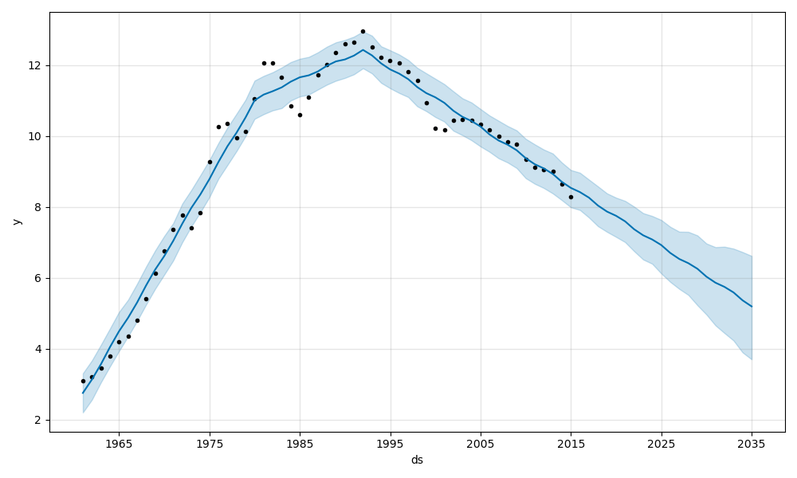
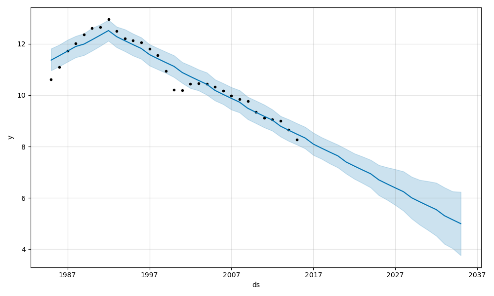
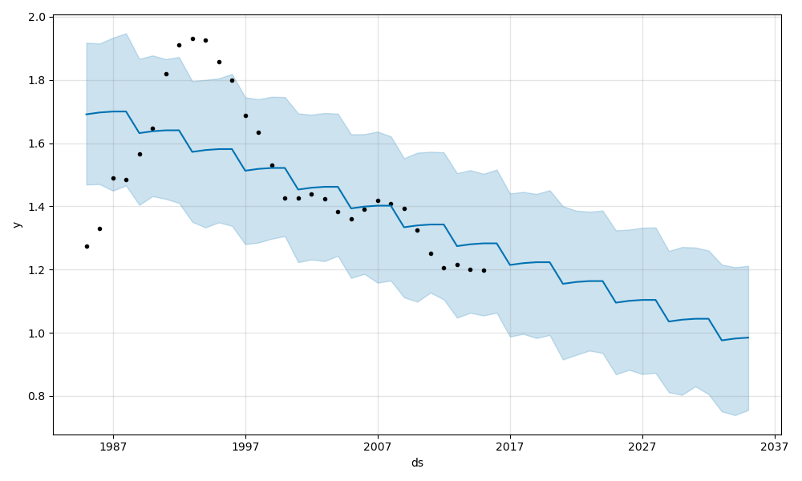
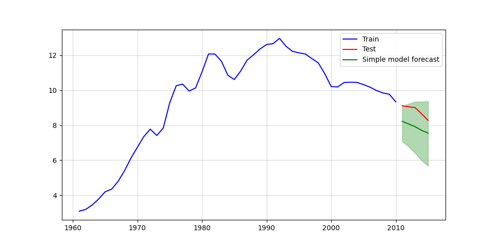
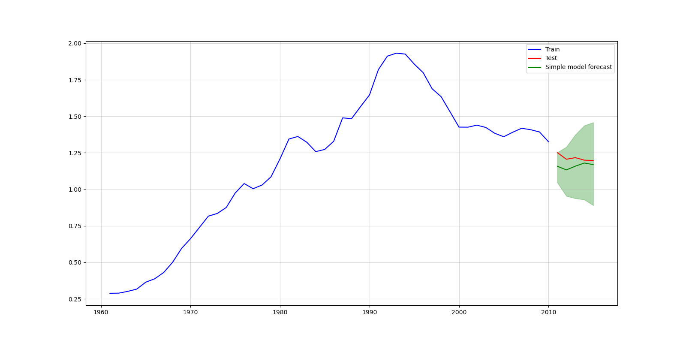
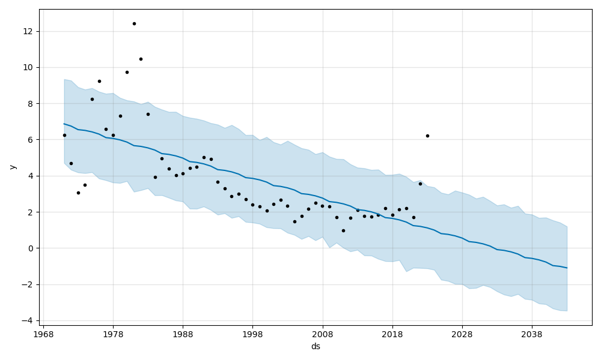
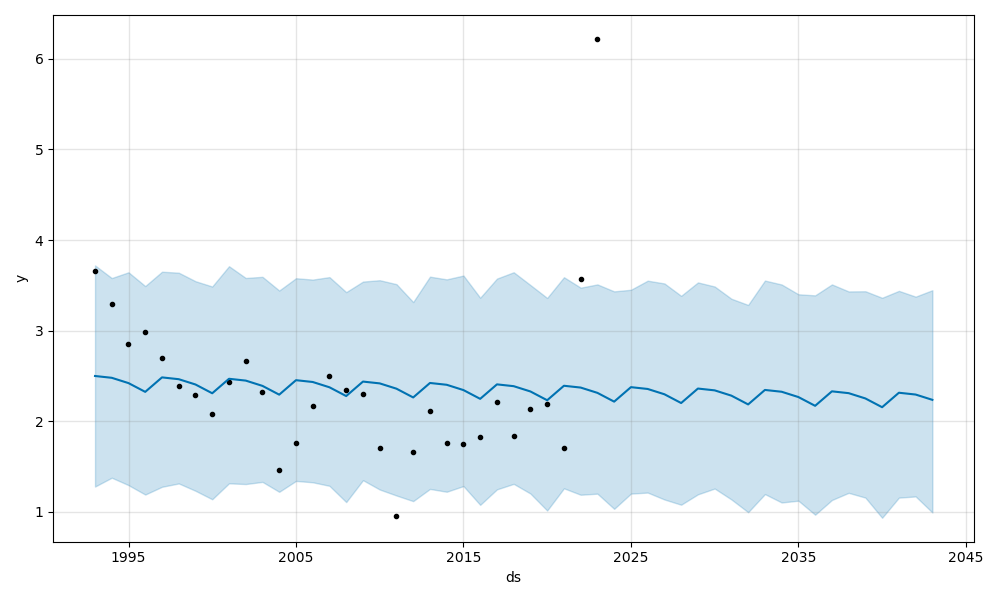
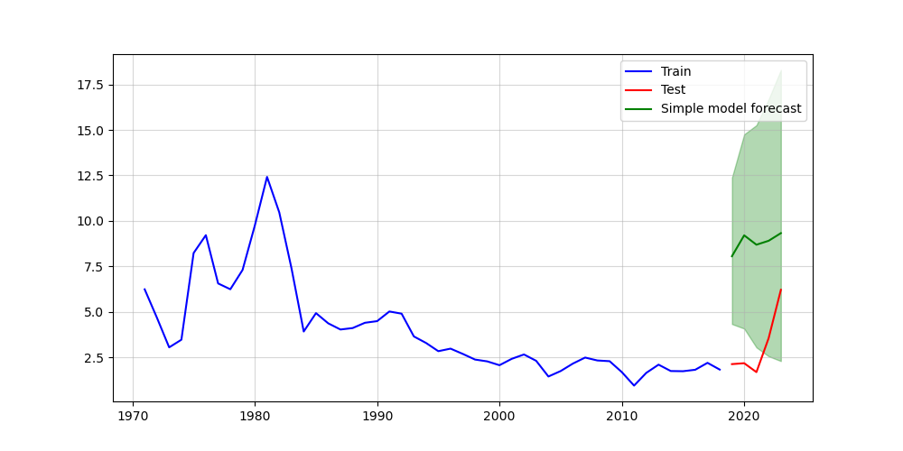

## Crime Analysis

#### Contributors

- Duran, Chris
- Kruel, Kimberly
- McClure, Mistie
- McDaniel, Geoff

### Overview
The project, initiated as part of an assignment from the ASU AI Development Bootcamp, explores and analyzes crime data on both a localized scale (State of Maryland) and nationwide across the US. The primary focus is on comparing the rates of violent and non-violent crimes with economic indicators such as inflation and unemployment rates. By examining these datasets, the team aims to uncover any significant correlations or trends that may exist between crime rates and economic conditions, providing insights into the potential impact of economic factors on crime.

### Published Section
- GitHub Pages: https://kkruel8100.github.io/Crime-Analysis/

### Table of Contents
- [Contributors](#contributors)
- [Overview](#overview)
- [Published Section](#published-section)
- [Summary](#summary)
- [Usage](#usage)
- [Installation](#installation)
- [Combined Review](#combined-review)
- [US crime rates 1960-2014](#US-crime-rates-1960-2014)
- [Inflation Rates 1970-2022](#inflation-rates-1970-2022)
- [Unemployment Rates 1991-2021](#unemployment-rates-1991-2021)
- [Resources](#resources)

### Summary
The analysis conducted in this project revealed a strong positive correlation between total violent, total non-violent crimes, and inflation rate, with correlation values ranging from 0.813683 to 0.970238. Conversely, the unemployment rate displayed a weak or no correlation with the other variables and was subsequently excluded from further in-depth predictive analysis. The predictive analyses utilized, including Prophet and a simple model analysis, yielded varying results. Prophet analysis predicted a decrease in non-violent crimes but an increase in violent crimes over the full range of data, with adjustments for the last 30 years showing a general downward trend for both crime types. The simple model analysis indicated similar trends but with differences in the test and forecast results, suggesting limitations in the data's predictive value over long periods. The overall conclusion highlights the challenges of using predictive models for datasets influenced by external factors and the necessity for more data over shorter periods to achieve meaningful results.
Content for the Introduction section.

## Installation
UPDATE THIS 

### Usage
This project provides a comprehensive analysis of crime data, inflation rates, and unemployment rates, offering insights into potential correlations and trends. Users can explore the analysis through a consolidated notebook or delve into specific topics via individual notebooks in the `SRC` folder. Follow the guide below to navigate and use the project effectively.

#### Running the Combined Analysis
1. **Open `main.ipynb`:**
   - Launch Jupyter Notebook or JupyterLab and open `main.ipynb`. This notebook integrates the entire analysis, combining crime data, inflation rates, and unemployment rates into a cohesive exploration.
   - Run all cells to execute the combined analysis. The notebook will automatically import and process data from individual notebooks, providing a comprehensive overview of the findings.
#### Exploring Individual Analyses
1. **Navigate to the `SRC` Folder:**
   - Within the Jupyter interface, navigate to the `SRC` folder to access individual notebooks for detailed analyses on specific topics.
2. **Individual Notebooks:**
   - `crime_1960_2014.ipynb`: Explore crime data from 1960 to 2014, including violent and non-violent crime rates.
   - `gm_crime_loc.ipynb`: Delve into localized crime data, focusing on geographical mapping and trends.
   - `inflation.ipynb`: Analyze inflation rate trends and their potential impact on economic conditions.
   - `unemployment.ipynb`: Examine unemployment rates and their correlations with other economic indicators.
   Open any of these notebooks to run detailed, topic-specific analyses. Each notebook contains instructions for running the analysis and interpreting the results.
#### Running Notebooks
- To run a notebook, open it in Jupyter Notebook or JupyterLab, and execute all cells by selecting "Run All" from the menu. This will process the data, run the analysis, and generate visualizations for exploration

### **Combined Review**

A correlation matrix was done comparing total violent, total non-violent, unemployment rate, and Official Core Consumer Price Inflation (inflation rate). The correlation matrix indicated a strong positive correlation between total violent, total non-violent, and inflation rate with values ranging from .813683 to .970238. The unemployment rate has no or weak negative correlation to the other rates.

Due to the lack of correlation, unemployment rate was eliminated from the more in depth prediction analysis that was applied to the other 3 data sets.

- Prophet analysis

  - Expected results: Similar trends in the predictions for inflation, total violent, and total non-violent.
  - Actual results:
    - When using the full range of data, prophet predicted that both inflation and non-violent crimes would decrease but violent crimes would increase.
    - When filtering the date range for the last 30 periods (years), prophet predicted steady inflation and downward trends for both non-violent and violent total crimes.
  - Conclusion: While prophet may be good for seasonal trends, it is not an accurate prediction modeling tool for data sets impacted by extraneous factors.

- Simple model analysis
  - Expected results: Similar trends in the predictions for inflation, total violent, and total non-violent. Similar results for test and forecast trends.
  - Actual results:
    - Predictions for inflation showed increases in inflation while total violent and total non-violent had downward trends. The test and forecast while similar curvature differed in results. The upper and lower bounds did overlap.
  - Conclusion:
    - The sample data is too small and over too long of a time period to give meaningful results. While the simple model did have more realistic trends compared to prophet, it is not an accurate prediction modeling tool for the data sets.

### **US crime rates 1960-2014**

US crime data was reported for violent and nonviolent crimes and categorized by type of crime. For more detailed analysis, charting was done for the separate classifications of non-violent and violent and was reported in the millions.

Non-violent crimes showed a steady increase from 1960 through the early 1990s. There has been a small downward trend from the peak in 1991 but remains higher than pre-1974.

Violent crimes

- Murder has reported steady results over the time span.
- Forcible rate showed and initial uptick in the late 1970s but has remained steady.
- Robbery and aggravated assault showed a steady increase through the early 1990s. There has been a small downward trend.
- Total violent crime has remained relatively steady over the time span.

Data Conclusions:

- Some initial upticks appear to correlate with new classifications of crime, for example 'date rape'.
- With the steady results in violent crime over the time period and non-violent crime peaking in 1991, it would indicate that this data set is not a comprehensive data set for the United States.
- With the questionable data, it is recommended that the results and analysis be for educational or conversational purposes and not be used for real-world application or extrapolation.

Prophet Analysis

- Non-violent crime

  - When using the full date range, prophet predicted non-violent crime to decrease in the future.

    
  
  - When filtering the date range for the last 30 periods (years), prophet predicted non-violent crime to decrease in the future.

    

  - There was no meaningful change in prophet predictions on this data set by changing the dates.

- Violent crime

  - When using the full date range, prophet predicted violent crime to increase in the future. Prophet interpreted the most recent data points as outliers.
  - When filtering the date range for the last 30 periods (years), prophet predicted violent crime to decrease in the future.

    

- Simple model analysis

  - Simple model had similar curvature for both non-violent and violent crime to decrease in the future but there were differences in forecasting results.

    

    

- Conclusion, limiting the data set to a more limited time span can have significantly different results. In addition, prophet has limited application on a dataset that is influenced by other factors. It is best for seasonal patterns. The simple model was closer in forecasting but showed significant differences in test and forecast data. To get meaningful results, more data is needed over a shorter time period.

_Note: COVID-19 lockdowns began approximately March 2020._

### **Inflation Rates 1970-2022**

Global data was filtered to United States. Inflation rate had data from 4 indexes: Food Consumer Price Inflation, Headline Consumer Price Inflation, Official Core Consumer Price Inflation, and Producer Price Inflation.

All 4 indexes trended similarly throughout the time period with peaks approximately 1974, 1980, and 2022. In general, after 1980 the inflation rates while fluctuating did trend overall lower until 2021.

For more in depth analysis, the Official Core Consumer Price Inflation was used for analysis.

Prophet Analysis

- Using the full date range, prophet predicted that inflation would continue to decline in future years and would reach negative inflation.

  

- When filtering the date range for the last 30 periods (years), prophet predicted significantly different results. Overall it showed consistent low inflation to continue to trend in the future. While the data had shown inflation rise in 2021, prophet interpreted this as an outlier.

  

- Conclusion, limiting the data set to a more limited time span can have significantly different results. In addition, prophet has limited application on a dataset that is influenced by other factors. It is best for seasonal patterns.

- Simple model analysis

  - Simple model had similar curvature for inflation increasing in the future but there were differences in forecasting results.

    

- Conclusion, simple model showed divergent results compared to crime results. This is contrary to the correlation matrix. To get meaningful results, more data is needed over a shorter time period.

_Note: COVID-19 lockdowns began approximately March 2020._

### **Unemployment Rates 1991-2021**

Global data was filtered to United States. The United States shows ups and downs throughout that period. The two lowest points occurred in 2000 (3.990) and 2019 (3.670). The two highest points occurred in 2020 (8.050) and 2010 (9.630).

_Note: COVID-19 lockdowns began approximately March 2020._

### Table of Contents
- [Contributors](#contributors)
- [Overview](#overview)
- [Published Section](#published-section)
- [Usage](#usage)
- [Installation](#installation)
- [Summary](#summary)
- [Combined Review](#combined-review)
- [US crime rates 1960-2014](#US-crime-rates-1960-2014)
- [Inflation Rates 1970-2022](#inflation-rates-1970-2022)
- [Unemployment Rates 1991-2021](#unemployment-rates-1991-2021)
- [Resources](#resources)

#### Resources

- US Crimes Data Set July 2016 to August 2022 https://www.kaggle.com/datasets/jgiigii/uscrimesdataset
  - 'Sources: Data.gov'
  - [CC0: Public Domain](https://creativecommons.org/publicdomain/zero/1.0/)
- US Crime Rates 1960-2014 https://www.kaggle.com/datasets/mahmoudshogaa/us-crime-rates-1960-2014
  - [Apache License 2.0](https://www.apache.org/licenses/LICENSE-2.0)
- Global Inflation Dataset (1970-2022) https://www.kaggle.com/datasets/belayethossainds/global-inflation-dataset-212-country-19702022
  - 'Acknowledgements: The data was collected from the official website of worldbank.org'
- Unemployment dataset https://www.kaggle.com/datasets/pantanjali/unemployment-dataset
  - 'Data sourced- https://data.worldbank.org/indicator/SL.UEM.TOTL.ZS'
  - [Attribution 4.0 International (CC BY 4.0)](https://creativecommons.org/licenses/by/4.0/)
